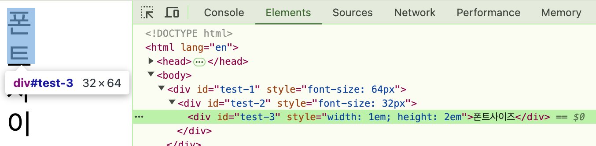

# 길이 단위인 px, em, rem에 대하여 설명해주세요.

## px

px은 화면의 고정적인 단위인 픽셀을 기준으로 한 고정 단위입니다. 화면의 비율과 크기에 상관 없이 픽셀에 의해서 요소의 크기가 결정됩니다.

## em

em은 부모 요소의 font-size를 기준으로 한 상대 단위입니다. 기본적으로 1em은 16px이지만, 부모 혹은 상단 요소의 font-size에 따라 변경 됩니다.

사진에서와 같이 적용하려는 요소의 상단 요소의 폰트 사이즈`32px`를 기준으로 합니다.

## rem

rem은 최상위 HTML 요소의 font-size를 기준으로 한 상대 단위입니다. em과 달리 요소 계층에 따라 크기가 누적되지 않고, 전역적인 기준을 따릅니다.

사진에서와 같이 적용하려는 요소의 상단 요소가 아니라, 최상단 HTML요소의 폰트사이즈 `16px`를 기준으로 합니다.
